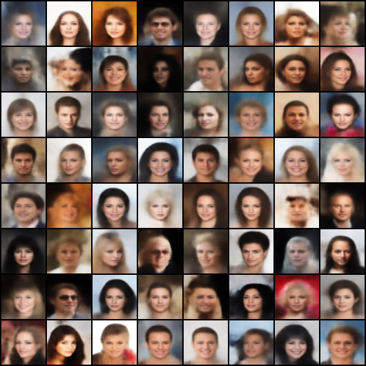

# Repro-VAEs

Reproduce VAEs with PyTorch.


## Training

Run command:

```shell
python train.py --config_path CONFIG_PATH
```


## Generation

Run command:

```shell
python generate.py \
    --model_path MODEL_PATH \
    --mode {random,walk,walk2d} \
    --save_path SAVE_PATH \
    --latent_dim LATENT_DIM \
    [--cpu] \
    [--img_size IMG_SIZE] \
    [--img_channels IMG_CHANNELS]
```


## Results


### VAE (Vanilla VAE)


